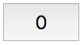
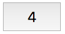
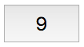

# Button Label

## The button's initial text label is 0. After each click, the button must increment by 1.

### Initially, the button looks like this:

### After the first 5 clicks, it looks like this:

### After more 5 clicks, it looks like this:
